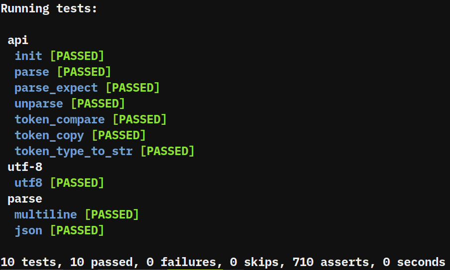

Parsello
========
A portable 'single file' _parser/lexer/tokenizer_.

Facts
-----
- minimalist API
- small and lightweight (~ 450 LOC)
- reasonably _fast_
- zero copy and zero memory allocs
- no dependencies (C std only)
- compiles on your toaster (C89 and up)
- doesn't touch the "source input" string
- single file

Getting Started
---------------
To get started, copy `src/prs.h` into your project
and create a new C file with the following content:

```c
#define PRS_IMPLEMENTATION
#include "prs.h"
```

You can also just include the implementation right
away without a _standalone_ C file, which is what we
are going to do in the examples presented below.

```c
#define PRS_IMPLEMENTATION
#include "prs.h"

const char *s = "...";

...

prs_context_t ctx;
prs_token_t token;

rs_init(&ctx, s);

while(prs_parse(&ctx, &token))
   printf("'%.*s' on line %d\n", token->len, token->s, token->line);
   
...
```

For a more realistic example let's take a look at parsing a simple structured
configuration file.

```c
config {
  name = "Leroy Jenkins"
}
```

And now the code that can be used to parse it.

```c
#include <stdio.h>
#include <stdlib.h>

#define PRS_IMPLEMENTATION
#include "prs.h"

void print_parse_expect_error(const prs_token_t *token, const char *s) 
{
    if(token->type == PRS_TOKEN_TYPE_INVALID)
        fprintf(stderr, "Parse Error: expected '%s' but reached end of string\n", s); 
    else
        fprintf(stderr, "Parse Error: expected '%s' but got '%.*s' on line %u\n",
                s, token->len, token->s, token->line);
}

int main(int argc, char *argv[])
{
  prs_context_t ctx;
  prs_token_t token;
  char name[64];
  const char *s = "config { name = "Leroy Jenkins" }";
  
  prs_init(&ctx, s);
  
  if(!prs_parse_expect(&ctx, &token, "config"))
  {
    print_parse_expect_error(&token, "config");
    return EXIT_FAILURE;
  }
  
  if(!prs_parse_expect(&ctx, &token, "{"))
  {
    print_parse_expect_error(&token, "{");
    return EXIT_FAILURE;
  }
  
  while(prs_parse(&ctx, &token))
  {   
      if(prs_token_compare(&token, "}"))
            break;
            
      prs_token_copy(&token, name, PRS_ARRAY_SIZE(name));
      
      if(!prs_parse_expect(&ctx, &token, "="))
        break;
      
      if(!prs_parse(&ctx, &token))
        break;
      
      printf("%s = %.*s\n", name, token.len, token.s);
  }
  
  if(!prs_parse_compare(&ctx, &token, "}"))
  {
    print_parse_expect_error(&token, "}");
    return EXIT_FAILURE;
  }
  
  return EXIT_SUCCESS;
}
```

For a more examples, please take a look at `src/samples/parse_config.c` and `src/tests/tests.c`.

What else can it parse?
-----------------------
It can parse and tokenize most things out there, because it comes
with reasonably set defaults and it's also possible to configure
how it "interprets" certain things by the means of preprocessor
definitions.

There is a small _sample_, called _tokenizer_ which will take
an input file, parse it and output each token on a separate
line.

```bash
$ premake4 gmake
$ make -C build
$ build/tokenizer src/prs.h
```

Anything starting with a _#_ is ignored by default, which means that
when parsing _C like_ things, preprocessor definitions will be skipped.

It is possible to disable this behavior, by defining _PRS_PARSE_PROCESSOR_.

```c
#define PRS_IMPLEMENTATION
#define PRS_PARSE_PREPROCESSOR
#include "prs.h"
```
##### What about UTF-8

```c
// Лерой Дженкинс
char *name = "Лерой Дженкинс";
```

UTF-8 in comments and strings is handled appropriately without any
additional or special configuration.

#### What about wchar_t and its noble friends?

```c
#define PRS_CHAR_TYPE wchar_t
#define prs_isalpha(c) iswalpha(c)
...
...

#define PRS_IMPLEMENTATION
#include "prs.h"
```

Of course that means that you have to _define_ all the _prs_is_* macros and
_point_ them to their _wchar_t_ compatible variants.

Tests
-----
To compile and run the tests:

```bash
$ premake4 gmake
$ make -C build
$ build/tests
```



The tests reside in the `src/tests/tests.c` file.

Contribute
----------
* Fork the project.
* Make your feature addition or bug fix.
* Do **not** bump the version number.
* Send me a pull request. Bonus points for topic branches.

License
-------
Copyright (c) 2018, Mihail Szabolcs

Parsello is provided **as-is** under the **MIT** license.
For more information see LICENSE.
